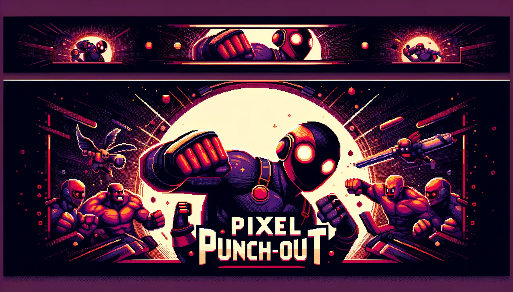

# Pixel Punch-Out WebSocket Server

Welcome to the **Pixel Punch-Out WebSocket Server** repository! This server handles real-time game events, player matchmaking, and other essential backend services for the Pixel Punch-Out game.

## Table of Contents

- [Introduction](#introduction)
- [Features](#features)
- [Technologies Used](#technologies-used)
- [Getting Started](#getting-started)
- [Usage](#usage)
- [Contributing](#contributing)
- [Contact](#contact)

## Introduction

The Pixel Punch-Out WebSocket Server is responsible for managing real-time interactions between players in the Pixel Punch-Out game. This includes handling game events, player matchmaking, and maintaining the state of the game. Built with Node.js and Socket.io, it ensures low-latency communication and a seamless gaming experience.

## Features

- **Real-Time Game Events:** Handles game events in real-time for a smooth gaming experience.
- **Player Matchmaking:** Manages player matchmaking to ensure balanced games.
- **State Management:** Maintains the state of the game and synchronizes it across connected clients.
- **Scalable Architecture:** Designed to support a large number of concurrent players.

## Technologies Used

- **Backend:** Node.js, Express.js
- **WebSockets:** Socket.io
- **Environment Variables Management:** dotenv
- **HTTP Client:** axios

## Getting Started

### Prerequisites

Make sure you have the following installed:

- Node.js
- npm

### Installation

1. **Clone the repository:**
   ```bash
   git clone https://github.com/yigitocak/Pixel-Punch-Out-Websocket-Server.git
   cd Pixel-Punch-Out-Websocket-Server
   ```

2. **Install dependencies:**
   ```bash
   npm install
   ```

3. **Set up environment variables:**
   Create a `.env` file in the root directory and add your environment variables.
   ```env
   BACKEND_URL=your_backend_url
   SECRET_KEY=your_secret_key
   ```

4. **Run the server:**
   ```bash
   npm start
   ```

## Usage

Once the server is running, it will handle real-time game events, player matchmaking, and other backend tasks. Connect your front-end application to this backend to utilize these services.

### WebSocket Events

- **Connection:**
  - When a player connects to the server, they are added to the game if there is space available. If the room is full, the connection is refused.

- **Player Actions:**
  - The server listens for player actions such as movement and updates the game state accordingly. These actions are communicated in real-time to other connected players.

- **Game Loop:**
  - The server runs a game loop at regular intervals to update the state of the game, apply physics, and synchronize the state across all clients.

### Example WebSocket Event Handlers

- **Handle Connection:**
  ```javascript
  this.io.on("connection", (socket) => {
    console.log(`A user connected: ${socket.id}`);
    // Handle player addition, listeners, etc.
  });
  ```

- **Handle Player Movement:**
  ```javascript
  socket.on("move", (data) => {
    // Update player position based on input data
  });
  ```

## Contributing

We welcome contributions! Here’s how you can help:

1. **Fork the repository.**
2. **Create a new branch:** `git checkout -b feature/your-feature`
3. **Commit your changes:** `git commit -m 'Add some feature'`
4. **Push to the branch:** `git push origin feature/your-feature`
5. **Create a Pull Request.**

## Contact

Have questions or feedback? Let’s connect!

- **Yigit Ocak:** [LinkedIn](https://www.linkedin.com/in/yigitocak/) - [Email](mailto:yigitockk@gmail.com)
- **Owen Orcan:** [LinkedIn](https://www.linkedin.com/in/owenorcan/) - [Email](mailto:owenorcan@gmail.com)


